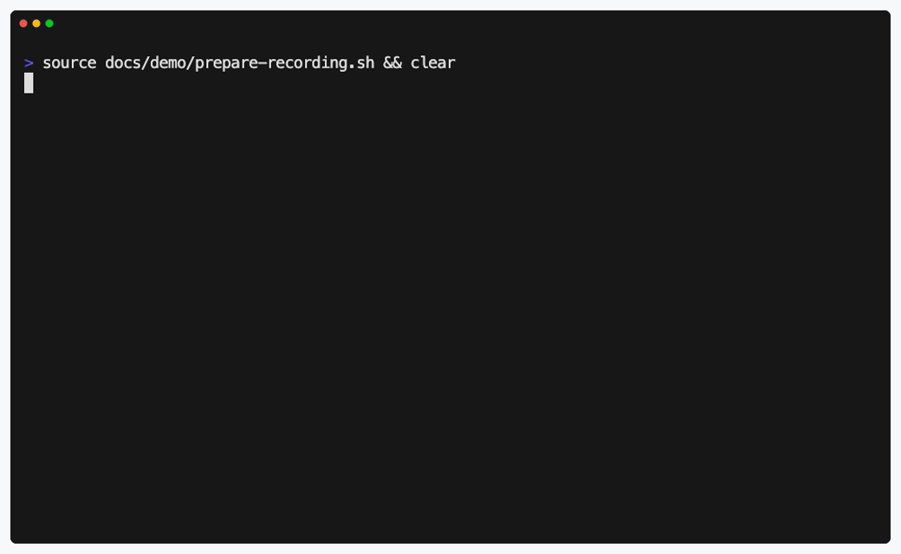

# SetupProof

[](https://github.com/setupproof/setupproof/actions/workflows/setupproof.yml)

Test marked README quickstarts from a clean workspace before contributors hit
them.

Setup docs drift because normal CI checks the code, not the commands people
copy from the README. SetupProof gives maintainers a small, explicit check for
that boundary: mark the shell block you expect to keep working, then run the
same block locally or in CI.



## Install

Prerequisites: Go 1.22 or newer, Git, and a POSIX shell.

```sh
go install github.com/setupproof/setupproof/cmd/setupproof@v0.1.0
setupproof --version
```

From a source checkout:

```sh
make build
./setupproof --version
```

## Use It

Mark a README shell block that should stay runnable:

````md
<!-- setupproof id=quickstart -->
```sh
go test ./...
```
````

Review the plan without executing commands:

```sh
setupproof review README.md
```

Run the marked blocks:

```sh
setupproof --require-blocks --no-color --no-glyphs README.md
```

Typical output is intentionally plain:

```text
[passed] README.md#quickstart file=README.md:12 runner=local timeout=120s result=passed
```

Unmarked shell examples stay inert.

## Adopt It

Create the default config:

```sh
setupproof init
```

That writes `setupproof.yml` with `README.md` as the default target, the local
runner, a 120 second timeout, `defaults.requireBlocks: true`, and no secret
environment passthrough. Existing files are not overwritten unless `--force` is
passed.

Use non-executing inspection while adding markers:

```sh
setupproof suggest README.md
setupproof --list README.md
setupproof review README.md
setupproof --dry-run --json --require-blocks README.md
```

## GitHub Actions

Pin both the Action and CLI version:

```yaml
name: SetupProof

on:
  pull_request:
  push:
    branches:
      - main

permissions:
  contents: read

jobs:
  readme-quickstart:
    runs-on: ubuntu-24.04
    timeout-minutes: 10
    steps:
      - uses: actions/checkout@v4
      - uses: setupproof/setupproof@v0.1.0
        with:
          cli-version: v0.1.0
          mode: review
          require-blocks: "true"
          files: README.md
      - uses: setupproof/setupproof@v0.1.0
        with:
          cli-version: v0.1.0
          require-blocks: "true"
          files: README.md
```

## Safety Model

- `suggest`, `review`, `doctor`, `--list`, and `--dry-run --json` do not
  execute commands.
- Execution uses a copied temporary workspace, not the live working directory.
- Local and Action runners are trusted-code runners.
- Docker improves isolation but is not a security sandbox.
- No telemetry. No update checks.
- Secrets pass only when configured.

## For Agents

Coding agents should treat SetupProof markers as the authoritative runnable
quickstart surface:

```sh
setupproof --list README.md
setupproof review README.md
setupproof --dry-run --json --require-blocks README.md
setupproof --require-blocks --no-color --no-glyphs README.md
```

Never execute unmarked Markdown shell blocks as SetupProof targets. See
`docs/AGENT_USAGE.md` and `llms.txt` for the full agent contract.

## Demos And Docs

- `docs/demo/setupproof.gif` shows the short terminal demo used above.
- `docs/demo/setupproof.tape` regenerates the GIF with VHS.
- `docs/demo/terminal-demo.sh` regenerates a short terminal demo from source.
- `docs/demo/terminal-demo.txt` is a checked transcript of the terminal demo.
- `docs/ARCHITECTURE.md` explains the package map and core invariants.
- `docs/AGENT_USAGE.md` defines the recommended workflow for coding agents.
- `docs/INSTALL.md` covers release archives, GitHub Actions, and CI snippets.
- `docs/RELEASE_READINESS.md` lists release checks.
- `schemas/` contains plan, report, and `setupproof.yml` JSON Schemas.
- `examples/` contains Node, Python, Docker Compose, monorepo, Go, and Rust
  fixtures.
- `SUPPORT.md` lists the information maintainers should include when reporting
  a setup-doc verification issue.

## Repository Checks

```sh
make check
```

For release-oriented changes, also run:

```sh
make staticcheck
make vuln
make actionlint
make release-archives
```

## License

SetupProof is licensed under the Apache License, Version 2.0 (`Apache-2.0`).
See `LICENSE` and `NOTICE`.

## Repository Dogfood

The marked block below is the repository's SetupProof check.

<!-- setupproof id=repo-smoke -->
```sh
go test ./...
go vet ./...
bash scripts/check-github-action.sh
sh scripts/check-examples.sh
sh scripts/check-docs.sh
```
